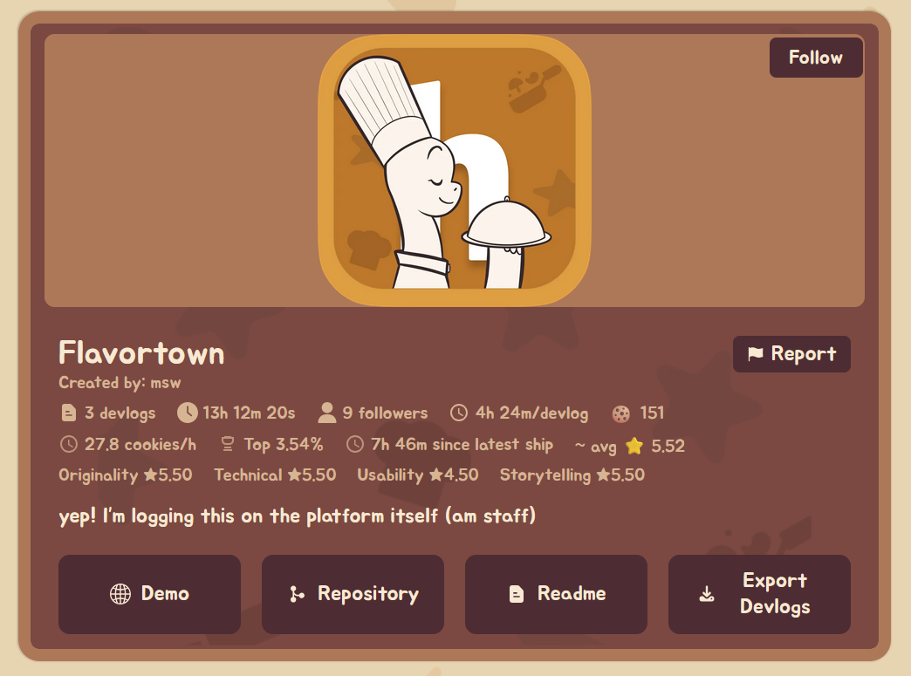

As Flavortown's EOL is nearing I am making this tool to be able to migrate Flavortown devlogs to other platforms like blogger, extension is for Chrome and Firefox.

_(As the name sugest, this project would only export the devlogs, but it also exports the project information, as the name, banner and follows)_

With this tool you can export all your devlogs as Markdown, JSON or even a ZIP.
- The markdown and JSON options give you the text content and information about the devlogs and project.
- The ZIP option lets you also download all attachments into folders at `attachments/devlog-{number}`, the ZIP option also includes the JSON and markdown inside.

The format of the JSON is the one presented [here](format.json).

# How to use:
Follow a regular extension download tutorial for Firefox or Chrome.
You can use the `Export Devlogs` button in your any project's page.
